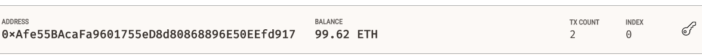
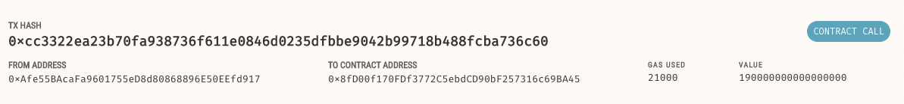

# Fintech_Finder_Blockchain
A platform that allows people to send crypto transactions to theoretical fintech professionals for hire

---

## Technologies

This application is written in Python v. 3.9.7 and is deployed using [Streamlit](https://docs.streamlit.io/). This application makes use of
the following libraries:


[web3](https://web3py.readthedocs.io/en/stable/) was used to interact with and send ethereum transactions

[streamlit](https://docs.streamlit.io/) was used for deploying the application to a webpage

[dataclasses](https://docs.python.org/3/library/dataclasses.html) was used to create dataclasses

[typing](https://docs.python.org/3/library/typing.html) was used for runtime support

[datetime](https://docs.python.org/3/library/datetime.html) was used to work with data sets in datetime format

[os](https://docs.python.org/3/library/os.html) was used to interact with the operating system to call upon env files

[dotenv](https://pypi.org/project/python-dotenv/) was used to import env files

[requests](https://pypi.org/project/requests/) was used to make HTTP requests

[bip44](https://pypi.org/project/bip44/) was used to assist in making a crypto wallet
---

## Installation Guide

Prior to running this application, perform the following in the command line to install the required libraries:

`pip install web3`

`pip install streamlit`

`pip install dataclasses`

`pip install typing`

`pip install datetime`

`pip install os`

`pip install dotenv`

`pip install requests`

`pip install bip44`

---

## Usage

In order to launch the application, navigate to the Fintech_Finder_Blockchain folder that contains all of the code for this application, and then type into the command line:

```
streamlit run fintech_finder.py
```

Once on the streamlit webpage that is deployed, the user can browse various fintech professionals and view their hourly rates in ether. From there, the user can select a professional and input the number of hours they need them for to view the total cost in ether. The user can then opt to send the transaction of the wage's cost to the professional using the send transaction button and see the resulting validation hash.

Below, you can see examples of one of these transactions being sent and the resulting account balance being viewed using Ganache: 




---

## Contributors

Robby Odum

Email: rodum012@gmail.com

---

## License

MIT
